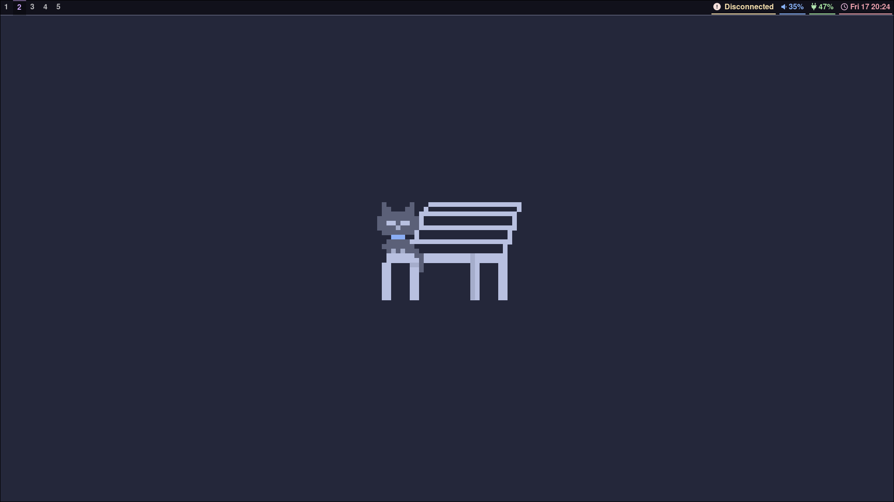
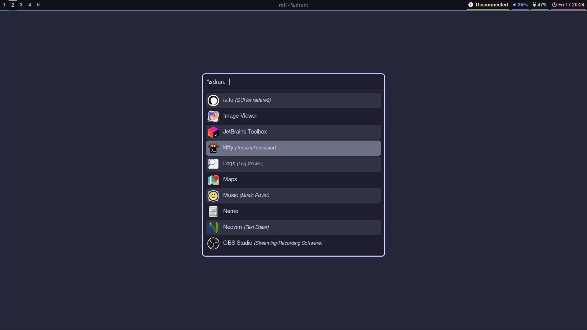
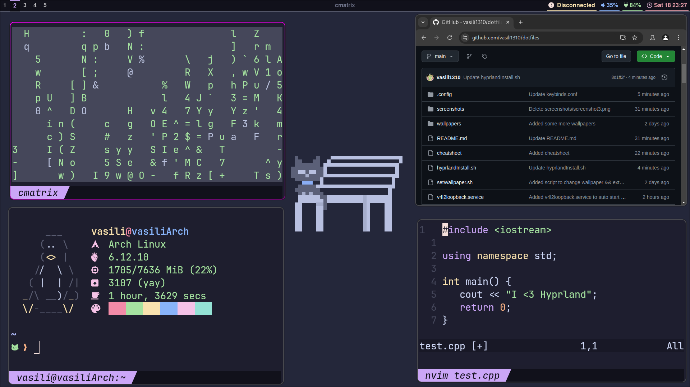

# dotfiles 🗂️
Minimalistic dotfiles for [Hyprland](https://github.com/hyprwm/Hyprland), based on the [Catppuccin](https://github.com/catppuccin/catppuccin) mocha theme.

## Features 🤩
1. **Custom keybindings**:Intuitive shortcuts for efficient navigation and window management.
2. **Theme and Appearance**: A modern, minimalistic aesthetic based on the pastel purple colors of Catppuccin mocha.
3. **Performance Tweaks**: Optimized settings for smooth animations and low system resource usage.
4. **Integration**: Seamless compatibility with popular Wayland applications and tools.
5. **Modules**:
  - **Bar/Panel**: Configuration for [Waybar](https://github.com/Alexays/Waybar) based on [Typecraft](https://github.com/typecraft-dev/dotfiles/tree/master/waybar/.config/waybar)'s and the [Catppuccin](https://github.com/catppuccin/catppuccin) waybar.
  - **Launchers**: Configuration for [Rofi](https://github.com/davatorium/rofi) application launcher.

## Screenshots 📸
## [Typecraft](https://github.com/typecraft-dev/dotfiles/tree/master/waybar/.config/waybar)'s waybar




## [Catppuccin](https://github.com/catppuccin/catppuccin) waybar


## Warning ⚠️

Please read the following before proceeding with the installation:

1. **The script was designed for Arch / Arch-based Linux distros, it will not work on any non-Arch distro.**
2. **This script is still a work in progress, you might encounter errors / bugs / glitches.**

With that out of the way, let's continue.

## Installation 🛠️
Follow these steps to install and apply this Hyprland configuration.

## Make sure you already have hyprland / hyprland-git installed (I recommend hyprland-git). You can install it with ```yay -S hyprland-git```.

### 1. Auto install with one command
```
bash <(curl -s "https://raw.githubusercontent.com/vasili1310/dotfiles/main/install.sh")
```

### 2. Manual install
Download the appropriate folders from .config and manually place them in your ~/.config/ directory.
